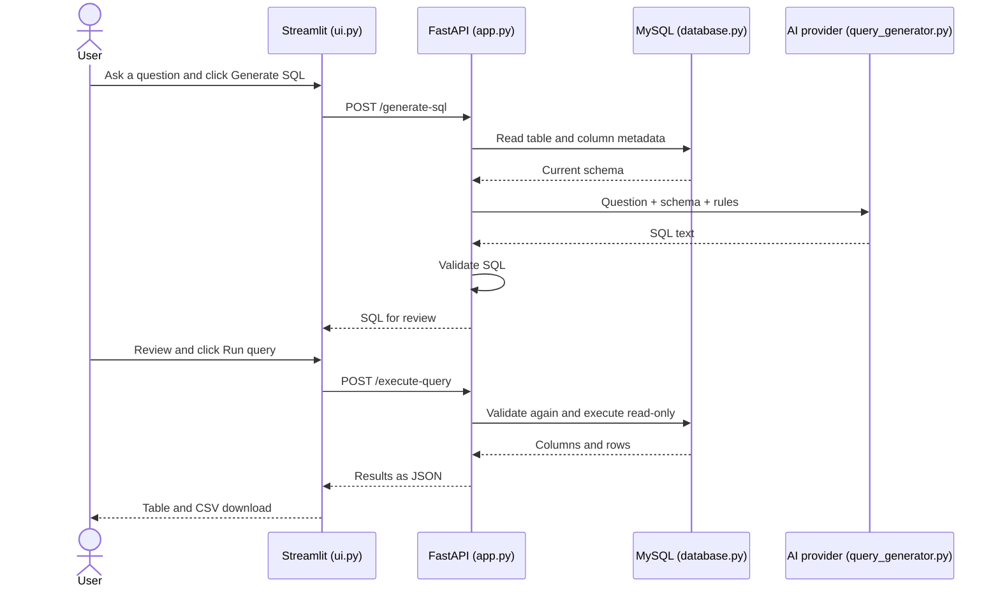

# Understand every file and the code inside it

Read this with the Python files open beside it. Explanations follow code blocks and
function names instead of line numbers, so small edits do not make the guide confusing.

## The project in one sentence

You ask a question in English; an AI writes SQL using your database structure;
you review it; MySQL runs it; the UI displays the real results.

The frontend and UI are the same Streamlit application here. FastAPI is a separate
backend. MySQL stores and retrieves data. The AI writes a query, not the result rows.



## Words used in the code

| Word | Simple meaning |
|---|---|
| Function | Named block of code that performs a task |
| Parameter | Input given to a function, such as a SQL string |
| Return | Send a result back to the caller |
| Dictionary | Named values such as `{'sql': 'SELECT 1'}` |
| List | Ordered collection of values |
| Schema | Description of the database tables and columns |
| API | A way for programs to request work from each other |
| Endpoint/route | API address for one operation, such as `/schema` |
| GET | HTTP request used here to retrieve information |
| POST | HTTP request used here to send a question or SQL in a body |
| JSON | Text format for sharing named values and lists between programs |
| Cursor | Database object used to execute SQL and fetch results |
| Exception | Error Python can catch and handle |
| Environment variable | Named setting supplied outside the source code |
| Transaction | Database work performed with a defined set of rules |
| Mock | Test replacement for an external service; used only in tests here |

## 1. database.py: all real MySQL work

### Imports and settings

`os` reads environment variables. `Path` locates `.env` beside this Python file.
`mysql.connector` communicates with MySQL. `sqlglot` parses SQL, and `exp` supplies
names for parsed SQL structures such as SELECT or DELETE. `load_dotenv` reads local settings.

`load_dotenv(Path(__file__).with_name('.env'))` runs when the module is first imported.
`__file__` means the path of this Python file. Using that path avoids searching for
`.env` in whichever unrelated folder a terminal happens to be in.

### connect()

`mysql.connector.connect(...)` opens a real database connection. Each `os.getenv`
reads a named setting with an optional fallback. `MYSQL_HOST` is preferred; the old
`MY_HOST` name is accepted. `int(...)` converts the port text to a number.
`connection_timeout=5` limits how long establishing the connection can wait.

The returned connection is used by other functions. This function does not create
tables or load sample rows. The configured database must already exist.

### database_error_message(error)

MySQL assigns numbers to common errors. The `messages` dictionary maps those numbers
to useful instructions. `.get(error.errno, fallback)` uses the matching message or a
generic fallback. It avoids displaying the raw error, which might reveal server/account details.

### check_connection()

Runs `execute_query('SELECT 1 AS connection_test')`, then `get_schema()`.
`SELECT 1` proves a small query can run without reading stored rows. Reading the schema
checks metadata access. The function returns connected status, database name, and table count.
Although it appears above those functions in the file, Python knows their definitions
by the time this function is called after importing the module.

### get_schema()

1. Open a connection and create a cursor.
2. Query `information_schema.COLUMNS`, MySQL's table/column metadata catalog.
3. `WHERE TABLE_SCHEMA = DATABASE()` restricts results to the configured database.
4. Sort by table and column position so the explorer is easier to read.
5. `fetchall()` retrieves the metadata rows. These are descriptions, not business records.
6. The loop unpacks each metadata row into `table`, `column`, and `data_type`.
7. `setdefault(table, [])` creates an empty list the first time a table is encountered.
8. `.append(...)` adds that column's description to its table's list.
9. Return a dictionary containing the database name and grouped tables.

`try ... finally` guarantees the connection is closed whether the operation succeeds
or fails. Example response shape, using illustrative names:

```json
{"database": "college", "tables": {"students": [{"name": "age", "type": "int"}]}}
```

### validate_sql(sql)

The AI can make mistakes, and the user can edit its output. This function checks both.

`sqlglot.parse(sql, read='mysql')` converts text into a tree representing SQL structure.
It is stronger than checking whether the text merely begins with `SELECT`.
Invalid syntax raises a readable `ValueError`.

The code requires exactly one statement and a SELECT at the top. `tree.walk()` visits
its parts and rejects write operations, output-file statements, and locking clauses.
`tree.find_all(exp.Func)` examines functions; only the listed common functions are allowed.
`tree.find_all(exp.Table)` rejects references to a different named database/catalog.
Finally, `tree.sql(dialect='mysql')` converts the accepted tree back to SQL text.

This deliberately supports a subset of SQL. It does not prove the query answers the
question correctly, verify every column against the schema, or replace MySQL permissions.
It rejects some legitimate advanced queries, including top-level UNION statements.

### execute_query(sql)

Validate before opening the connection. Set `MAX_EXECUTION_TIME` to 5000 milliseconds
for supported SELECT execution and `SQL_SELECT_LIMIT` to 201 for queries without their
own limit. Start a read-only transaction, then execute the validated SQL.

`fetchmany(201)` retrieves up to 201 rows. The response includes only `rows[:200]`.
The extra row lets `truncated` indicate that more than 200 rows were available.
An explicit SQL LIMIT can override the session select limit; the display cap is still 200.

`cursor.description` contains column metadata. `[c[0] for c in cursor.description]`
is a list comprehension that extracts the first item (the name) from each column description.
Rows are returned as lists, preserving column positions even if two columns share a name.
Closing the connection ends the transaction; there is no write commit.

## 2. query_generator.py: turn a question into SQL

### Imports

`json` turns the schema dictionary into text. `os` reads provider settings.
`re` handles simple text cleanup. `requests` calls the external AI service over HTTP.
`validate_sql` comes from our database module.

### Provider selection

`generate_sql(question, schema)` receives two inputs from FastAPI. It reads
`AI_PROVIDER`, chooses Gemini, Groq, or OpenAI, and selects that provider's key, endpoint,
and model. A Gemini default is supplied; OpenAI requires an explicit model setting.
Groq uses `GROQ_API_KEY` and defaults to `openai/gpt-oss-20b`, a model served by Groq.
Unknown providers and missing keys cause readable errors rather than fake SQL results.

### The prompt

The `prompt` string tells the model to return a single read-only MySQL query, use the
provided schema, and avoid unsupported operations. It lists supported functions and
requests `CANNOT_ANSWER` when the question does not fit the available database.
`json.dumps(schema)` places the real table/column descriptions into that prompt.

This is prompt engineering, not training. No model weights are changed by the project.

### The HTTP request

`requests.post(...)` sends the request to the chosen provider. The Authorization header
contains the AI key. The JSON body contains the model and two messages: system rules
and the user's question. `timeout=45` sets the HTTP timeout used by Requests.

A 429 response produces a quota message. 401/403 produce an access message.
`raise_for_status()` catches other failed HTTP status codes. The code extracts generated
text from `choices[0]['message']['content']`. Exceptions are converted into an error
message without copying the provider's raw response into the UI.

### Cleanup and validation

Reject empty/non-text output. `re.sub(...)` removes an optional opening/closing Markdown
code fence. If the model returns `CANNOT_ANSWER`, show that the available tables cannot
answer the question. Otherwise call `validate_sql` and return the accepted SQL string.
Generation never executes SQL. Validation runs again later if the user clicks Run query.

## 3. app.py: the API connecting UI, AI, and MySQL

### Imports, app, and request classes

`FastAPI(...)` creates the application with a title and version. `Request` is used in
error-handler signatures. `JSONResponse` sends structured error responses.
`BaseModel` and `Field` describe expected input using Pydantic, which FastAPI uses for validation.

`Question` requires question text between 1 and 2000 characters. `Query` requires SQL
between 1 and 10000 characters. Bad request bodies receive a validation response
before the endpoint function executes. Whitespace-only questions are rejected separately.

### Decorators and handlers

A line beginning with `@app...` registers the function below it with FastAPI.
The two exception handlers convert `ValueError` or database failures into HTTP 400
responses with a `detail` message. They are `async` handlers; the database/API work in
normal `def` endpoints remains synchronous, handled by FastAPI's execution machinery.

### Four routes

| Route | Function and result |
|---|---|
| `GET /connection` | Calls `check_connection()` and returns real connection status |
| `GET /schema` | Calls `get_schema()` and returns real table/column metadata |
| `POST /generate-sql` | Checks question, loads fresh schema, rejects empty schema, calls AI, returns SQL |
| `POST /execute-query` | Passes SQL to `execute_query()` and returns columns, rows, and truncation flag |

Returning a Python dictionary allows FastAPI to create a JSON response.
FastAPI also creates the interactive `/docs` page for trying these routes.

Example request/response for generation (illustrative, not guaranteed AI output):

```json
{"question": "Show students older than 20"}
```

```json
{"sql": "SELECT * FROM students WHERE age > 20 LIMIT 200"}
```

## 4. ui.py: the frontend the user sees

### Imports and page setup

`pandas` represents results as a table. `requests` calls our local FastAPI server.
`streamlit` creates the page with Python functions. `API_URL` identifies the backend.
`st.set_page_config` sets the browser title and centered layout.
`.streamlit/config.toml` defines a simple light theme: white background, light-gray
input areas, dark text, and a muted accent color. It uses Streamlit's built-in
theme settings without custom CSS. The theme changes appearance, not functionality.

### call_api(path, payload=None)

This helper avoids repeating HTTP-handling code. Without a payload it sends GET;
with a payload it sends POST and JSON. It decodes the response, shows the backend's
error message for unsuccessful requests, and returns either data or `None`.
Network failures or invalid JSON show a local API connection message.

### Sidebar

**Test database connection** calls `/connection` and shows the real configured database
and visible table count. **Load tables and columns** calls `/schema` and saves it in
`st.session_state.schema`. Each table appears inside a collapsible `st.expander`.
The app does not use hard-coded table names to populate this explorer.

### Question form

`st.form` groups the question field and Generate SQL button. Submitting calls the API.
The code clears old results and old SQL, checks for blank input, displays a spinner,
and stores successful generated SQL in `st.session_state.sql`.

Streamlit reruns the script after interactions. `session_state` preserves values across
those reruns, so the SQL and results do not disappear immediately.

### Review, execute, and results

The second text area is linked to the `sql` session key. It is editable, allowing the
user to correct the AI output or paste a manual SELECT query.
Run query is disabled while the SQL box is empty. Clicking it calls `/execute-query`.
The app saves both returned results and the exact executed SQL for display.

`pd.DataFrame(rows, columns=...)` turns the JSON rows into a table. `st.dataframe`
displays it. `len(frame)` reports displayed rows. The truncation message explains
the display cap. `frame.to_csv(index=False)` creates a CSV without pandas' extra row index,
and `st.download_button` lets the user save it. CSV contains the displayed result rows.

## 5. check_database.py: test the real integration

This optional command-line helper imports the same connection logic used by FastAPI.
`main()` runs the check, prints safe diagnostic messages, and returns 0 on success or
1 on failure. Shells use those numbers as success/failure status.

`if __name__ == '__main__'` means run this code only when this file is launched directly.
`raise SystemExit(main())` exits with the chosen status. No AI key is needed.

## 6. sample_data.sql: optional learning data

`CREATE DATABASE IF NOT EXISTS` creates a practice database only if absent.
`USE` selects it. The two CREATE TABLE statements define `users` and `orders`.
An order's `user_id` is a foreign key linking it to a user's `id`.

`INSERT IGNORE` adds illustrative rows and skips conflicting keys; it does not replace
existing rows. Existing table definitions are not upgraded by `IF NOT EXISTS`.
The commented account commands are examples for manual administrator setup.
No Python file automatically runs this script. Skip it for your real database.

## 7. Configuration and dependency files

`.env` contains your private local values. `.env.example` contains placeholders that
explain the expected names. `.gitignore` keeps `.env`, the virtual environment, and
Python-generated caches out of normal Git tracking. It does not remove secrets already committed.

`requirements.txt` lists installable packages and acceptable version ranges:

| Package | Why it is here |
|---|---|
| fastapi | Backend routes and request handling |
| uvicorn | Runs the FastAPI server |
| streamlit | Builds and serves the Python UI |
| pandas | Represents result tables and exports CSV |
| requests | Sends HTTP requests to FastAPI and the AI provider |
| mysql-connector-python | Talks to the real MySQL server |
| python-dotenv | Reads `.env` settings |
| sqlglot | Parses and checks SQL structure |
| httpx | Supports the API test client |

Pydantic is installed as a FastAPI dependency and imported in `app.py`.
`.venv` is the isolated Python environment containing installed packages. Do not edit
its internal files; it is generated tooling, not project source you need to present.

## 8. tests/test_project.py: verification, not application data

`unittest.TestCase` groups automated checks. Test methods cover accepted SQL, rejection
of unsafe operations, transaction settings, the result cap, key/quota handling, API
validation, connection reporting, empty schema handling, and UI interactions.

`patch(...)` temporarily replaces an external dependency only inside that test.
For example, a mocked AI response lets the test check the UI without spending API quota.
`TestClient` calls API routes in-process. Streamlit's `AppTest` simulates UI interactions.
Assertions compare actual behavior with the expected behavior and fail if it differs.

The normal app never imports this test file. Passing mocked tests verifies our logic,
not your credentials, server availability, model access, or generated SQL accuracy.
Use `check_database.py` and a reviewed real query for live integration verification.

## 9. Documentation files

`README.md` is the entry point and run guide. `REAL_DATABASE_SETUP.md` explains connecting
an existing database. This file explains code. `PRESENTATION_GUIDE.md` contains an
outline and speaking notes you can adapt to your actual database and test evidence.
